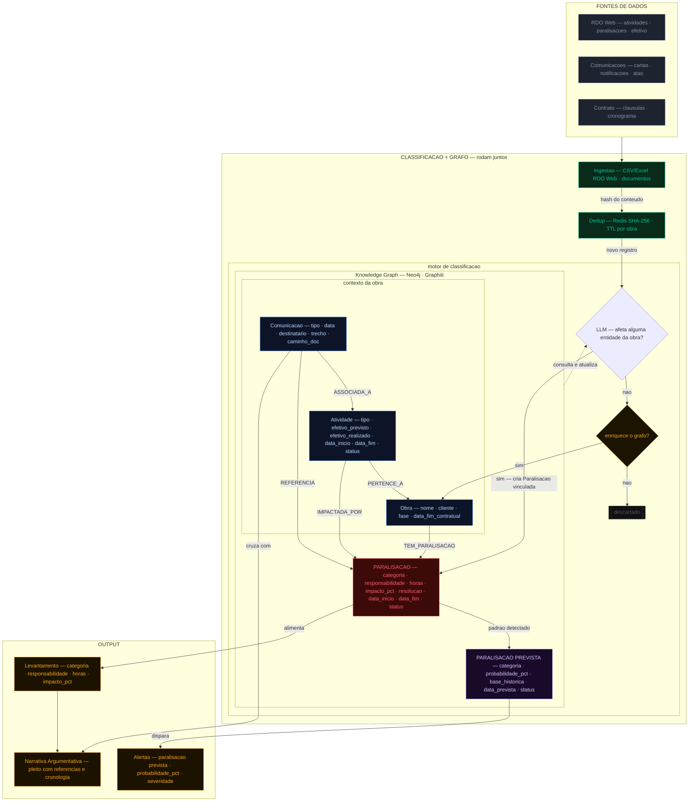

# Segundo Cérebro de Obra — Knowledge Graph

Este documento descreve a arquitetura do Knowledge Graph do Segundo Cérebro de Obra: como os dados do RDO Web e comunicações contratuais são ingeridos, classificados e transformados em inteligência acionável para gestão contratual e montagem de pleitos.

---

## Diagrama

---

## Por que um Knowledge Graph?

Obras de infraestrutura produzem dois tipos de dado que raramente se conversam: o dado **quantitativo** — horas de paralisação, efetivo alocado, atividades executadas — e o dado **qualitativo** — a carta ao cliente, a notificação de atraso, a ata onde o cliente assumiu responsabilidade.

O valor está na conexão entre eles. Um Knowledge Graph representa essas conexões nativamente: ele sabe que a paralisação do dia X foi pela categoria W, que a responsabilidade é do cliente, que há uma carta anterior ao evento, e que o impacto acumulado justifica um pleito. Essa é a história da obra — e hoje ela existe apenas na memória dos gestores.

---

## Fontes de dados

**RDO Web** — atividades, paralisações, efetivo e fatos relevantes exportados em CSV/Excel. É a fonte mais estruturada e o ponto de partida. Automação via API é avaliada em paralelo para eliminar exportação manual futuramente.

**Comunicações contratuais** — cartas, notificações e atas. Fontes textuais que, cruzadas com o RDO Web, constroem o registro qualificado da obra: quem disse o quê, quando e sobre qual paralisação.

**Contrato** — cláusulas e cronograma. Contextualiza a responsabilidade de cada paralisação e define os marcos temporais relevantes para o cálculo de impacto.

---

## Pipeline de classificação

Premissa central: **nenhum dado é armazenado antes de ser classificado como relevante**. O pipeline tem duas etapas de decisão:

**Etapa 1 — Afeta alguma entidade do grafo?** Se sim, cria um nó `:Paralisacao` já vinculado às entidades afetadas. Nenhum documento intermediário é salvo.

**Etapa 2 — Enriquece o grafo?** Uma nova atividade ou comunicação ainda não mapeada entra no grafo mesmo sem gerar paralisação imediata. Se não houver nada aproveitável, o registro é descartado.

Todo registro passa antes por deduplicação via hash SHA-256 no Redis — se já foi processado dentro da janela de TTL da obra, é descartado imediatamente. O LLM consulta o grafo antes de decidir e o atualiza após cada classificação, garantindo que o contexto da obra esteja sempre atual.

---

## Entidades do Knowledge Graph

O grafo tem três entidades de contexto (`:Obra`, `:Atividade`, `:Comunicacao`) e duas entidades de evento (`:Paralisacao` e `:ParalisacaoPrevista`). `:Motivo` e `:Periodo` foram removidos como nós — motivo vira campo direto em `:Paralisacao`, e período é calculado via query sobre as datas já existentes.

### `:Paralisacao`

Nó central. Representa um evento real já ocorrido, extraído do RDO Web. As atividades impactadas são capturadas via aresta `IMPACTADA_POR → :Atividade` — não há campo separado para isso no nó. Quando o grafo acumula paralisações suficientes numa mesma categoria, detecta o padrão e gera automaticamente um nó `:ParalisacaoPrevista`.

| Campo | Descrição |
|---|---|
| `categoria` | `falta_material`, `climatico`, `aprovacao_cliente`, `interferencia_terceiros`, `decisao_cliente`, `outro` |
| `responsabilidade` | `Contratada`, `Cliente` ou `Externo` |
| `horas` | Horas perdidas no evento — dado atômico rastreável ao RDO Web |
| `impacto_pct` | `horas / efetivo_previsto_da_atividade_no_periodo` — gravidade relativa do evento |
| `resolucao` | Como e quando a paralisação foi encerrada |
| `data_inicio` / `data_fim` | Duração do evento |
| `status` | `aberto`, `documentado`, `pleiteado` |

### `:ParalisacaoPrevista`

Gerada pelo próprio grafo a partir do padrão detectado em `:Paralisacao` — não pelo pipeline de ingestão. Representa uma paralisação ainda não ocorrida, identificada com base no histórico acumulado. É a origem dos alertas.

| Campo | Descrição |
|---|---|
| `categoria` | Herdada do padrão histórico detectado |
| `probabilidade_pct` | Estimada com base na frequência histórica daquela categoria no grafo |
| `base_historica` | Referências às paralisações passadas que embasam a previsão |
| `data_prevista` | Janela temporal estimada para ocorrência |
| `status` | `ativo`, `confirmado` (virou paralisação real), `descartado` |

### `:Obra`

Entidade raiz. Todas as atividades e paralisações pertencem a uma obra.

| Campo | Descrição |
|---|---|
| `nome` | Identificador da obra |
| `cliente` | Contratante |
| `fiscalizadora` | Órgão fiscalizador quando aplicável |
| `data_inicio_contratual` | Início previsto em contrato |
| `data_fim_contratual` | Entrega prevista |
| `fase` | Fase contratual corrente |
| `status` | `em_andamento`, `paralisada`, `concluida` |

### `:Atividade`

Cada frente de trabalho da obra. A relação `IMPACTADA_POR` conecta cada atividade à paralisação que a afetou. O campo `efetivo_previsto` é a base do cálculo de `impacto_pct` em `:Paralisacao`.

| Campo | Descrição |
|---|---|
| `tipo` | Concretagem, instalações, estrutura, mobilização... |
| `data_inicio` | Início previsto ou realizado |
| `data_fim` | Término previsto ou realizado |
| `efetivo_previsto` | Trabalhadores previstos — base do cálculo de `impacto_pct` |
| `efetivo_realizado` | Trabalhadores efetivamente alocados |
| `status` | `em_andamento`, `paralisada`, `concluida` |

### `:Comunicacao`

Comunicação formal da obra. O campo `trecho` carrega o excerto relevante extraído pelo LLM — a aresta `REFERENCIA` usa esse vínculo para conectar a comunicação à paralisação correspondente, sem duplicar informação.

| Campo | Descrição |
|---|---|
| `tipo` | `carta`, `notificacao`, `ata` |
| `data` | Data de emissão |
| `destinatario` | Cliente, fiscalizadora ou terceiro |
| `trecho` | Excerto extraído pelo LLM que justifica o vínculo com a paralisação |
| `caminho_doc` | Caminho para o arquivo físico do documento |

---

## Relações entre entidades

Propriedades que existem nos nós não são repetidas nas arestas. Agregações por período e acumulados por categoria são calculados via query sobre `data_inicio`, `data_fim` e `horas` de `:Paralisacao`.

| Relação | De → Para | Descrição |
|---|---|---|
| `TEM_PARALISACAO` | Obra → Paralisacao | Vincula o evento à obra |
| `IMPACTADA_POR` | Atividade → Paralisacao | Registra quais frentes foram afetadas |
| `REFERENCIA` | Comunicacao → Paralisacao | Conecta o documento ao evento que documenta |
| `PERTENCE_A` | Atividade → Obra | Hierarquia da obra |
| `ASSOCIADA_A` | Comunicacao → Atividade | Conecta o documento à frente de trabalho referenciada |
| `PADRAO_DETECTADO` | Paralisacao → ParalisacaoPrevista | Gerada automaticamente quando o grafo identifica recorrência |

---

## Output

**Levantamento de Paralisações** — classificação por categoria e responsabilidade, com horas e percentual de impacto. Rastreável diretamente ao RDO Web. Agrega por período via query sobre `data_inicio` e `data_fim`.

**Narrativa Argumentativa** — o LLM cruza `:Paralisacao` com `:Comunicacao` via `REFERENCIA` e gera um rascunho de pleito com cronologia, responsabilidades e referências documentais.

**Alertas de Paralisação Prevista** — gerados a partir de `:ParalisacaoPrevista`, que é criada quando o grafo detecta padrão de recorrência em `:Paralisacao`. O alerta inclui `probabilidade_pct` e é classificado por severidade — alertas acima de um threshold configurável são sinalizados como graves e surfaçados com prioridade.
