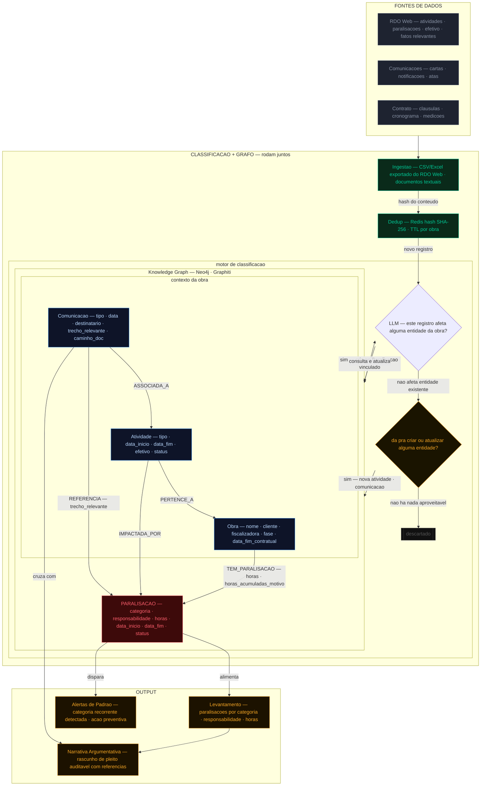

# Segundo Cérebro de Obra — Knowledge Graph

Este documento descreve a arquitetura do Knowledge Graph do Segundo Cérebro de Obra: como os dados do RDO Web e comunicações contratuais são ingeridos, classificados e transformados em inteligência acionável para gestão contratual e montagem de pleitos.

---

## Diagrama

---

## Por que um Knowledge Graph?

Obras de infraestrutura produzem dois tipos de dado que raramente se conversam: o dado **quantitativo** — horas de paralisação, efetivo alocado, atividades executadas, registrado no RDO Web — e o dado **qualitativo** — a carta enviada ao cliente naquela semana, a notificação sobre atraso de fornecimento, a ata onde o cliente assumiu responsabilidade por uma interferência.

O valor não está em nenhum dos dois isoladamente. Está na conexão entre eles. Um Knowledge Graph representa essas conexões nativamente: ele sabe que a paralisação do dia X foi pela categoria W, que a responsabilidade é do cliente, que há uma carta de notificação associada com data anterior à paralisação, e que o impacto acumulado no mês justifica um pleito. Essa é a história da obra — e hoje ela existe apenas na memória dos gestores.

---

## Fontes de dados

**RDO Web** — extrato de atividades, registro de paralisações, controle de efetivo e fatos relevantes, exportados em CSV/Excel. É a fonte mais estruturada e o ponto de partida. A automação via API do RDO Web é avaliada em paralelo para eliminar o processo de exportação manual em versões futuras.

**Comunicações contratuais** — cartas ao cliente, notificações formais e atas de reunião. São fontes textuais não estruturadas que, cruzadas com os dados do RDO Web, constroem o registro qualificado da obra: quem disse o quê, quando, sobre qual paralisação.

**Contrato** — cláusulas contratuais, cronograma de entregas e medições. Contextualiza a responsabilidade de cada paralisação (Contratada / Cliente / Externo) e define os marcos temporais relevantes para o cálculo de impacto.

---

## Pipeline de classificação

O pipeline tem uma premissa central: **nenhum dado é armazenado antes de ser classificado como relevante para a obra**. Isso evita acúmulo de registros sem valor e mantém o grafo limpo e auditável.

### Ingestão e deduplicação

Todo registro ingerido passa por deduplicação via Redis. Um hash SHA-256 é calculado sobre o conteúdo e verificado contra os hashes já processados dentro da janela de TTL configurada por obra. Se o registro já foi visto, é descartado imediatamente. Se é novo, segue para classificação.

### Classificação com contexto do grafo

O LLM e o Knowledge Graph rodam juntos, não em sequência. O modelo não classifica registros de forma genérica — ele classifica em relação ao contexto específico da obra, consultando o grafo em tempo real para saber quais atividades estão em andamento, quais paralisações já foram mapeadas e quais comunicações existem no período.

O fluxo de decisão tem duas etapas:

**Etapa 1 — O registro afeta alguma entidade existente no grafo?** Se sim, o modelo extrai categoria, responsabilidade, horas e período, e cria um nó `:Paralisacao` já vinculado às entidades afetadas. Nenhum documento intermediário é salvo.

**Etapa 2 — Se não afeta diretamente, dá para criar ou atualizar alguma entidade?** Uma nova atividade ou uma comunicação ainda não mapeada enriquecem o grafo mesmo sem gerar uma paralisação imediata. Só após essa verificação, se não houver nada aproveitável, o registro é descartado.

---

## Entidades do Knowledge Graph

O grafo tem quatro entidades. `:Motivo` e `:Periodo` foram intencionalmente removidos como nós — motivo vira campo direto em `:Paralisacao`, e período é calculado via query sobre as datas já existentes, sem necessidade de um nó dedicado.

### `:Paralisacao`

O nó central do grafo. Carrega tudo que identifica o evento: o que aconteceu, quanto tempo durou, de quem é a responsabilidade e qual o impacto acumulado daquele tipo de paralisação na obra.

| Campo | Descrição |
|---|---|
| `categoria` | `falta_material`, `climatico`, `aprovacao_cliente`, `interferencia_terceiros`, `decisao_cliente`, `outro` |
| `responsabilidade` | `Contratada`, `Cliente` ou `Externo` |
| `horas` | Horas perdidas neste evento específico |
| `data_inicio` | Início da paralisação |
| `data_fim` | Fim da paralisação |
| `status` | `aberto`, `documentado`, `pleiteado` |

### `:Obra`

Entidade raiz. Todas as atividades e paralisações pertencem a uma obra.

| Campo | Descrição |
|---|---|
| `nome` | Identificador da obra |
| `cliente` | Contratante |
| `fiscalizadora` | Órgão fiscalizador quando aplicável |
| `data_inicio_contratual` | Data de início prevista em contrato |
| `data_fim_contratual` | Data de entrega prevista |
| `fase` | Fase contratual corrente |
| `status` | `em_andamento`, `paralisada`, `concluida` |

### `:Atividade`

Cada frente de trabalho em execução na obra. Paralisações são sempre vinculadas às atividades que impactaram.

| Campo | Descrição |
|---|---|
| `tipo` | Concretagem, instalações, estrutura, mobilização... |
| `data_inicio` | Início previsto ou realizado |
| `data_fim` | Término previsto ou realizado |
| `efetivo_previsto` | Número de trabalhadores previstos |
| `efetivo_realizado` | Número de trabalhadores efetivamente alocados |
| `status` | `em_andamento`, `paralisada`, `concluida` |

### `:Comunicacao`

Toda comunicação formal da obra. É a entidade que conecta o dado quantitativo do RDO Web ao registro qualitativo contratual, permitindo que um pleito cite tanto as horas perdidas quanto o documento que notificou o cliente sobre aquele evento.

| Campo | Descrição |
|---|---|
| `tipo` | `carta`, `notificacao`, `ata` |
| `data` | Data de emissão |
| `destinatario` | Cliente, fiscalizadora ou terceiro |
| `trecho_relevante` | Trecho extraído pelo LLM que justifica o vínculo com a paralisação |
| `caminho_doc` | Caminho para o arquivo físico do documento (PDF, digitalização) |

---

## Relações entre entidades

| Relação | De → Para | Propriedades |
|---|---|---|
| `TEM_PARALISACAO` | Obra → Paralisacao | `horas`, `horas_acumuladas_motivo` |
| `IMPACTADA_POR` | Atividade → Paralisacao | — |
| `REFERENCIA` | Comunicacao → Paralisacao | `trecho_relevante` |
| `PERTENCE_A` | Atividade → Obra | — |
| `ASSOCIADA_A` | Comunicacao → Atividade | `data`, `tipo` |

A temporalidade do Graphiti está nas arestas `TEM_PARALISACAO` via `valid_from` e `valid_until` — quando o status de uma paralisação muda, a aresta anterior é preservada com seu timestamp e uma nova é criada, mantendo o histórico completo da obra sem perda de rastreabilidade.

---

## Como o impacto é medido

O impacto é medido em **horas absolutas**. Essa decisão tem três razões práticas: as horas já existem no RDO Web, são o dado mais confiável disponível desde o início; são diretamente auditáveis, pois o argumento de pleito aponta para o registro específico que originou aquele número; e o percentual pode ser calculado em cima delas quando necessário, sem precisar ser armazenado.

Na prática, o grafo mantém dois níveis de granularidade:

**`horas`** em `:Paralisacao` — o dado atômico de cada evento, rastreável até o registro individual do RDO Web.

**`horas_acumuladas_motivo`** na aresta `TEM_PARALISACAO` — a soma de todas as horas perdidas por aquela categoria de paralisação na obra até o momento. É o número que alimenta o argumento de pleito: "foram X horas perdidas por atraso de aprovação do cliente no período de Y a Z."

Agregações por período (semana, mês, fase contratual) são calculadas via query sobre os campos `data_inicio` e `data_fim` de `:Paralisacao`, sem necessidade de um nó dedicado para isso.

---

## Output

**Levantamento de Paralisações** — classificação automática por categoria e responsabilidade, com total de horas por período calculado via query. Base auditável para pleitos com rastreabilidade direta ao RDO Web.

**Narrativa Argumentativa** — o LLM cruza os dados quantitativos das paralisações com as comunicações formais associadas e gera um rascunho de argumentação de pleito: cronologia dos fatos, responsabilidades, horas acumuladas por categoria e referências documentais. O que levava semanas de levantamento manual passa a levar horas.

**Alertas de Padrão** — quando uma categoria de paralisação acumula recorrência acima de um threshold configurável, o sistema emite um alerta para que a equipe tome ação preventiva antes que o impacto se torne irreversível no cronograma.
